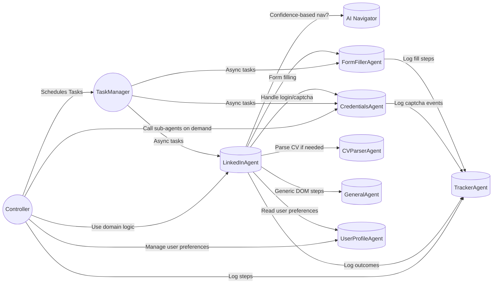
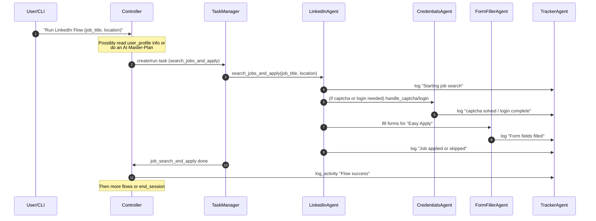
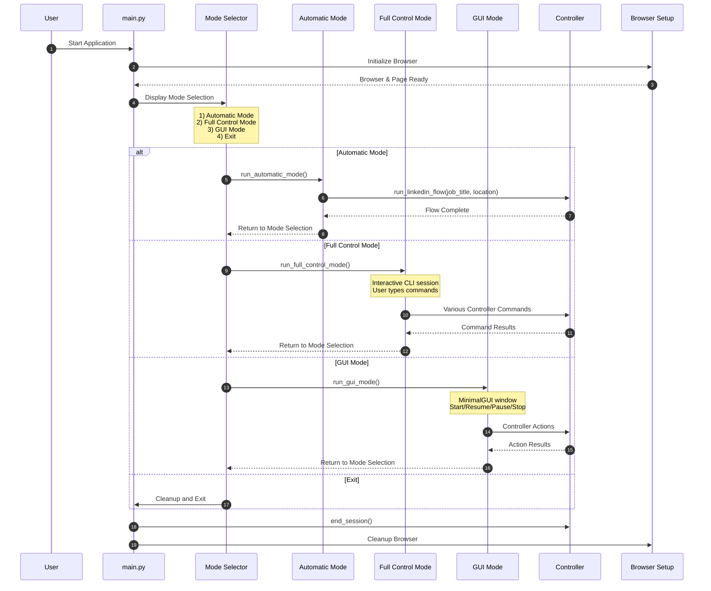

# Application Architecture

## Agent Interaction Flow

## Sequence Flow Example

## Entry Points and User Interaction Flow

## Architecture Notes

### Key Components

1. **Controller**: Central orchestrator that manages the overall flow
2. **TaskManager**: Handles async task scheduling and execution
3. **Agents**: Specialized components for specific tasks
   - LinkedInAgent: LinkedIn-specific automation
   - AINavigator: Confidence-based navigation
   - CredentialsAgent: Authentication and CAPTCHA handling
   - FormFillerAgent: Form automation
   - CVParserAgent: Resume parsing
   - GeneralAgent: Common functionality
   - TrackerAgent: Logging and monitoring
   - UserProfileAgent: User data management

### Flow Description

1. The Controller initiates all major operations
2. TaskManager handles async execution of tasks
3. LinkedInAgent coordinates most LinkedIn-specific operations
4. Other agents provide specialized functionality
5. All significant events are logged via TrackerAgent

### Design Principles

1. Separation of concerns
2. Async-first architecture
3. Centralized logging
4. Modular agent system
5. Fallback mechanisms 