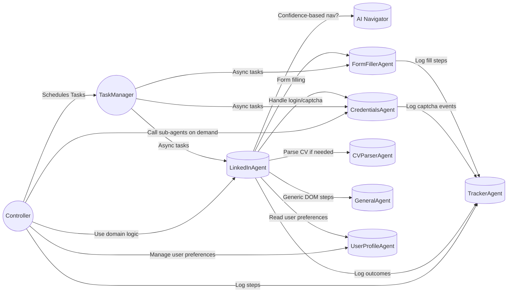
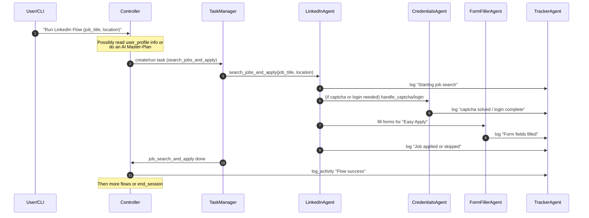

# AI Browser Job Workflow

An intelligent multi-agent system that automates professional job search and application processes on LinkedIn while maintaining compliance with platform terms of service.

## Overview
This system uses multiple specialized AI agents to:
- Search and analyze job postings
- Match job requirements with user qualifications
- Automate application form filling
- Track application status and interactions
- Handle authentication and security
- Manage rate limits and platform compliance

## Project Structure

For a detailed view of the project's directory structure and file organization, see [DIRECTORY_STRUCTURE.md](DIRECTORY_STRUCTURE.md)

## Architecture Diagrams

<!-- MERMAID-START -->

### Agent Interaction Flow



### Sequence Flow Example



<!-- MERMAID-END --> 

## Features

### Currently Active
- Basic LinkedIn Automation
  - Job search and filtering
  - "Easy Apply" detection
  - Session management
- CV & Document Processing
  - PDF parsing
  - Basic field extraction
  - Cover letter generation (GPT-4)
- System Infrastructure
  - CSV/JSON-based storage
  - Logging functionality
  - Human-like delays
  - Concurrency safety

### Pending Activation (Phase 1)
- AI-Driven Navigation
  - Confidence-based actions
  - Self-diagnostic error handling
  - Learning pipeline integration
- Enhanced Form Filling
  - AI-powered field detection
  - Smart validation
  - Automated retries

### Future Roadmap
- Phase 2 (Post-MVP)
  - Cloud/SaaS Integration
  - Multi-Platform Support
  - Chrome Extension
  - Database Implementation
  - Advanced AI Features

- Phase 3 (Long-term)
  - Full Autonomy System
  - Intelligent Engagement
  - Advanced Analytics
  - Enterprise Solutions

For a detailed development roadmap and timeline, see [ROADMAP.md](ROADMAP.md)

## Requirements

### Core Dependencies
- Python 3.8+
- Selenium 4.11.2
- Playwright 1.49.0
- pandas 2.1.0
- python-dotenv 1.0.0
- Pillow 10.0.0 (CAPTCHA processing)
- pydantic 2.10.4 (Data validation)
- LangChain 0.3.14+ (AI integration)
- requests 2.31.0
- beautifulsoup4 4.12.2
- linkedin-api 2.0.0
- pytest 7.4.0
- logging 0.4.9.6
- httpx 0.27.2+
- posthog 3.7.0+

### Optional Dependencies
- tokencost (Token tracking)
- hatch (Build tool)
- pytest-asyncio (Async testing)

## Setup
1. Clone the repository
2. Install dependencies: 
   ```bash
   pip install -r requirements.txt
   pip install "pydantic[email]"    # Required for email validation
   playwright install               # Install browser binaries
   ```
3. Copy `.env.example` to `.env` and configure:
   - TWO_CAPTCHA_API_KEY (optional)
   - LinkedIn credentials (for future automated login)
   - Other platform settings
4. Run the application: `python main.py`

## System Operation

### Starting the Application
```bash
python main.py
```

### Interactive Menu Flow

1. **Browser Selection**
   ```
   Select Browser:
   1) Edge (recommended)
   2) Chrome
   3) Firefox
   4) Attach to existing browser (Chromium-based)*
   ```
   *Note: To attach to existing browser, launch it with:
   ```bash
   # For Chrome:
   google-chrome --remote-debugging-port=9222
   # For Edge:
   msedge --remote-debugging-port=9222
   ```

2. **Operation Mode Selection**
   ```
   Operation Mode:
   1) Automatic Mode (autopilot)
   2) Full Control Mode (interactive CLI)
   3) GUI Mode
   4) Exit
   ```

### Operation Modes

#### 1. Automatic Mode
- Runs predefined workflow automatically
- Handles job search and application process
- Minimal user intervention required
- Shows real-time progress updates

#### 2. Full Control Mode (CLI)
Available commands:
- `start`: Begin job search workflow
- `stop`: Pause current operations
- `status`: Check progress statistics
- `config`: Update preferences
- `export`: Export history/analytics
- `quit`: Return to mode selection

#### 3. GUI Mode
- Minimal graphical interface
- Visual progress tracking
- Basic control buttons
- Real-time status updates
(Currently in development)

### Error Recovery
- System provides graceful error handling
- Option to retry or switch modes
- Automatic resource cleanup
- Session persistence where possible

### Session Management
- Browser sessions can be persistent or temporary
- Cookies and preferences are saved between runs
- Automatic cleanup on exit
- Support for headless operation

## Usage
1. Start the application using the CLI:
   ```bash
   python main.py
   ```
2. Use the following CLI commands:
   - `start`: Begin job search and application workflow
   - `stop`: Pause all operations
   - `status`: Check current progress and statistics
   - `config`: Update search and application preferences
   - `export`: Export application history and analytics
   - `quit`: Exit the application

3. Browser Extension:
   - Install the extension from the `ui/extension` directory
   - Monitor job search progress
   - Review application statuses
   - Adjust search parameters
   - View analytics and insights

## License
This project is licensed under the Apache License 2.0 - see the [LICENSE](LICENSE) file for details.

### License Verification
To verify the integrity of the LICENSE file:
1. The LICENSE file should be exactly 11,357 bytes in size
2. It should contain the complete Apache License 2.0 text
3. The copyright notice should read:
   ```
   Copyright [2025] Mudakka Consulting FZ-LLC
   ```
4. You can verify the license text matches the official Apache License 2.0 by comparing with:
   https://www.apache.org/licenses/LICENSE-2.0.txt

### AI Architecture

#### Autonomy Levels
1. **Basic Automation** (Current)
   - Systematic approach to job search and application
   - Pre-defined patterns and workflows
   - Direct user control for major decisions

2. **Enhanced Pattern Recognition** (Next)
   - Learning from successful interactions
   - Basic decision-making capabilities
   - Systematic approaches as primary fallback

3. **Guided Autonomy** (Short-term)
   - Natural language instruction processing
   - Context-aware decision making
   - Proactive error prevention
   - Systematic approaches as secondary fallback

4. **Full Autonomy** (Long-term)
   - Independent strategy formulation
   - Self-optimizing workflows
   - Predictive problem solving
   - Systematic approaches as last resort

#### Progressive AI Enhancement
1. **Intelligent Decision Making**
   - Natural language understanding
   - Context-aware actions
   - Learning from past interactions
   - Autonomous strategy adjustment
   - Self-diagnostic capabilities
   - Confidence scoring for actions

2. **Deep Learning Integration**
   - Obstacle pattern recognition
   - Adaptive navigation strategies
   - Problem-solving evolution
   - Historical success analysis
   - Continuous learning pipeline

3. **Smart Application Strategy**
   - Autonomous application decisions
   - Intelligent form filling
   - Dynamic response generation
   - Self-improving success rates
   - Confidence-based fallback triggers

4. **Intelligent Engagement**
   - Smart recruiter interaction
   - Context-aware company engagement
   - Autonomous follow-up planning
   - Strategic relationship building
   - Engagement success prediction

5. **Adaptive Error Recovery**
   - Self-diagnostic capabilities
   - Autonomous problem resolution
   - Dynamic fallback strategy selection
   - Progressive learning from errors
   - Confidence-based approach selection

6. **User Preference Learning**
   - Natural language preference understanding
   - Dynamic strategy adaptation
   - Learning from user feedback
   - Autonomous preference refinement
   - Preference-confidence mapping

#### Implementation Strategy
1. **Progressive Enhancement**
   - Start with robust systematic approaches as foundation
   - Gradually layer AI capabilities on top
   - Maintain systematic approaches as reliable fallbacks
   - Continuous learning and improvement
   - Confidence threshold monitoring

2. **Fallback Mechanism**
   - AI-first approach for all operations
   - Monitoring of AI performance and decisions
   - Confidence score evaluation
   - Graceful degradation to systematic approaches
   - Learning from fallback incidents

3. **Learning Pipeline**
   - Obstacle pattern database
   - Solution strategy evolution
   - Success rate tracking
   - Automated strategy refinement
   - Confidence score calibration

